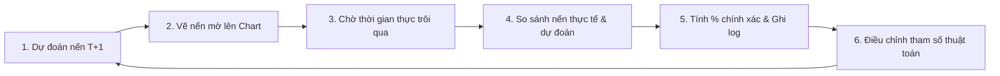

# Crypto Real-time Predictor Chart - Project Overview

Tóm tắt ý tưởng phát triển hệ thống vẽ biểu đồ nến Crypto thời gian thực kết hợp thuật toán tự học dự đoán nến tương lai và tối ưu hóa doanh thu từ quảng cáo.

---

## 1. Ý tưởng cốt lõi (Core Concept)
*   **Vẽ biểu đồ nến real-time:** Hiển thị biểu đồ nến của các cặp tiền điện tử (ví dụ: BTC/USDT) cập nhật liên tục từng giây.
*   **Dự đoán tương lai trực quan:** Thuật toán tính toán và vẽ các cây nến mờ (semi-transparent klines) ở tương lai trực tiếp trên biểu đồ.
*   **Vòng lặp tự học (Self-learning Loop):** Khi thời gian trôi qua, hệ thống so sánh nến thực tế với nến đã dự đoán -> tính toán tỉ lệ chính xác (%) -> tự động điều chỉnh tham số thuật toán để nâng cấp độ chính xác ở các nến sau.

---

## 2. Kiến trúc hệ thống (System Architecture)

*   **Dữ liệu đầu vào:** REST API (lấy nến lịch sử) và WebSocket (cập nhật nến real-time) từ **Binance API** (Miễn phí, ổn định).
*   **Backend (Python/Node.js):** 
    *   Nhận dữ liệu từ Binance.
    *   Chạy thuật toán dự đoán (Machine Learning/Genetic Algorithm).
    *   Tính toán sai số và thực hiện tối ưu hóa tham số trực tuyến (Online Optimization).
*   **Frontend (HTML/JS):** Sử dụng thư viện **TradingView Lightweight Charts** để vẽ biểu đồ nến mượt mà, hỗ trợ render nến mờ ở tương lai bằng hệ màu RGBA.

---

## 3. Quy trình tự học của thuật toán (Feedback Loop)

---

## 4. Kế hoạch Deploy & Chi phí (VPS/Hosting)

*   **Frontend:** Deploy lên **Vercel / GitHub Pages** (Miễn phí).
*   **Backend & Nginx:** Chạy trên **VPS Ubuntu** (Ví dụ: Hetzner hoặc DigitalOcean) bằng **Docker Compose**.
*   **Chi phí ước tính:** ~$5/tháng (Khoảng 120,000 VND) bao gồm tiền VPS giá rẻ và tên miền (.xyz/.tech) để cài SSL bảo mật kết nối WebSocket (`wss://`).

---

## 5. Chiến lược tạo doanh thu chi tiết (Monetization - 100% Free cho User)

Dự án sẽ cung cấp công cụ hoàn toàn miễn phí để tối đa hóa lượng người dùng (User Base), từ đó tạo dòng tiền thông qua 3 kênh chính:

### A. Tích hợp Mạng lưới Quảng cáo Crypto (Crypto Ad Networks)
Vì Google AdSense hạn chế mảng Crypto, trang web sẽ tích hợp các mạng lưới quảng cáo chuyên biệt:
*   **Coinzilla & Bitmedia.io:** Đặt banner quảng cáo (kích thước $728 \times 90$ hoặc $300 \times 250$) ở rìa ngoài biểu đồ. Nhận tiền theo lượt hiển thị (CPM) hoặc lượt click (CPC).
*   **A-Ads (Anonymous Ads):** Quảng cáo hiển thị không cần theo dõi người dùng, thanh toán nhanh bằng USDT/BTC.

### B. Tiếp thị liên kết (Affiliate Marketing)
*   Đặt nút **"Đăng ký sàn giao dịch"** (Binance, Bybit, OKX) kèm mã giới thiệu (Ref Link) của bạn ngay trên thanh menu hoặc bên cạnh biểu đồ.
*   Khi người dùng đăng ký qua link này và thực hiện giao dịch theo dự đoán của biểu đồ, sàn sẽ trả lại cho bạn **20% - 50% phí giao dịch** của họ trọn đời.

### C. Tài trợ trực tiếp (Direct Sponsorship)
Khi biểu đồ có lượng truy cập (traffic) ổn định:
*   Bán vị trí đặt logo nổi bật của các sàn giao dịch hoặc các dự án token mới ngay trên biểu đồ.
*   Tích hợp nút **"Giao dịch nhanh token này trên sàn X"** và thu phí duy trì hàng tháng từ các đối tác sàn giao dịch đó.
